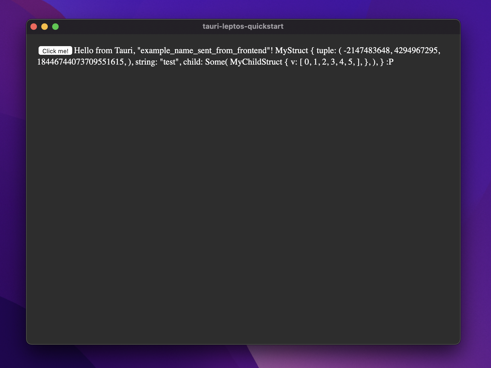

# tauri-glue
proc macro support for interfacing between rust frontends (e.g., [leptos](https://github.com/gbj/leptos)) and [tauri](https://github.com/tauri-apps/tauri) (i.e., a rust-based desktop-app backend).

## Example usage
1. create a tauri command in the backend using the ***command*** macro:
   ```rust
   use tauri_glue::*;

   #[tauri_glue::command]
   fn hello(name: String, test_struct: MyStruct) -> Result<String, String> {
       Ok(format!(
           "Hello from Tauri, {:?}! {:#?} :P",
           name, test_struct
       ))
   }
   ```
2. in the frontend and backend, include the dependency:
   ```toml
   tauri-glue = { git = "https://github.com/DPM97/tauri-glue" }
   ```
3. in the frontend, create a binding to the backend command using the ***bind_command*** macro:
   ```rust
   use tauri_glue::*;

   #[tauri_glue::bind_command(name = hello)]
   pub async fn hello(name: String, test_struct: MyStruct) -> Result<String, String>;
   ```
4. call the binding
   ```rust
    match hello("example_name_sent_from_frontend".to_string(), MyStruct { 
        tuple: (i32::MIN, u32::MAX, u64::MAX), 
        string: "test".to_string(),
        child: Some(MyChildStruct {
            v: vec![0, 1, 2, 3, 4, 5]
        })
    }).await {
        Ok(message) => {
            set_name.update(|name| *name = message);
        }
        Err(e) => {
            let window = window().unwrap();
            window
                .alert_with_message(&format!("Error: {:?}", e))
                .unwrap();
        }
    }
   ```
5. 